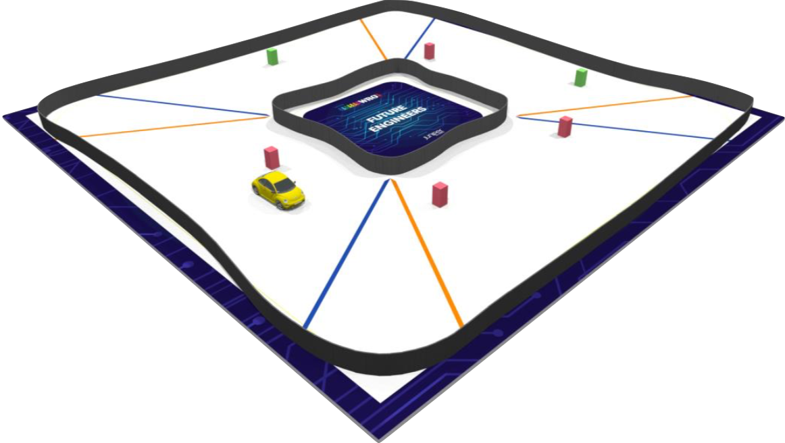

# WRO Future Engineers Getting Started

Starting from the season 2020 [World Robot Olympiad](https://wro-association.org/association/introduction){target=_blank} extends the set of the competitions suggested for school students around the world by a new competition "Future Engineers".

The WRO Future Engineers is the competition of the self-driven vehicles. Students of the age group from 15 till 19 need to design a model of a car, equip it with electromechanical components and program it as so it will be able to autonomously drive on the track avoiding objections.

More details about the competition can be found on [the official site of WRO Association](https://wro-association.org/competition/new-competition-formats/future-engineers){target=_blank}.

The Future Engineers challenge does not limit the students with any specific hardware and programming languages that is why working with electromechanical components (motors and sensors) and/or with a micro controller could cause some difficulties. Moreover, the most effective way to make the car fully autonomous is to use a camera and computer vision algorithms which are also completely new direction in WRO competition and never used before. Therefore the goal of this site is to provide materials for an initial understanding how the self-driving vehicle can be assembled and how it can be programmed to achieve a result in the competition.

This site covers the following topics:

  * [Chassis](p01-chassis.md) -- how to assemble a vehicle
  * [Electromechanical components](p02-electronics.md) -- which electromechanical components and controllers can be used and how to connect them to each other
  * [Basics of SBM and SBC programming](p03-programming.md) -- materials describing different aspects of programming Arduino and Raspberry Pi boards
  * [Computer vision](p04-cv.md) -- a pipeline that can be used to implement an algorithm to solve the challenge
  * [Miscellaneous](p05-misc.md) -- extra materials that do not fit in other sections
  * [Robot sets](p06-robot-sets.md) -- robot sets that can be used for a quick start

Enhoy with getting new knowledge and skills!

_This site was generated from the content located in the GitHub repository: [https://github.com/akolotov/future-engineers-gs/](https://github.com/World-Robot-Olympiad-Association/future-engineers-gs){target=_blank}. If you have any suggestions or found some bugs/inconsistencies please report them in form of [the GitHub issue](https://github.com/World-Robot-Olympiad-Association/future-engineers-gs/issues/new){target=_blank}._