# Computer vision

One of the focuses of the Future Engineers competition is to allow students to learn how to use computer vision for solving practical problems.

_Computer vision is an interdisciplinary scientific field that deals with how computers can gain high-level understanding from digital images or videos. From the perspective of engineering, it seeks to understand and automate tasks that the human visual system can do._

This definition is picked up from [Wikipedia](https://en.wikipedia.org/wiki/Computer_vision){target=_blank}

Although the overall trend in the modern information technologies is to use the computer vision together with [the machine learning](https://en.wikipedia.org/wiki/Machine_learning){target=_blank} and approaches that also include [deep learning](https://en.wikipedia.org/wiki/Deep_learning){target=_blank}, the Future Engineers competition does not require familiarity with them. Below you can find clarification on why it is so. 

## Physical considerations

Before writing a line of the code for the computer vision implementation, think:

  - what resolution of the camera is suitable for the vehicle?
  - how must the camera be directed to solve the task more efficiently?
  - is it necessary to mount another lens before the camera's image plane?

### Camera resolution

The camera resolution determines how many pixels are in the frame received from the camera. Usually, it is specified as the amount of pixels in the row and the number of rows. For example, 640 x 480 says that each frame will contain 480 rows and every row consists of 640 pixels. In total, it will be 307200 pixels in the frame.

This should help you to understand that higher resolution frames (e.g. standard HD, 720p that is 1280 x 720) contains more pixels than low resolution frames. So it is logical that more time is required to transfer these pixels and process them with an image processing algorithm. If your CPU is not so powerful, you would do better to use cameras with lower resolution or configure a high resolution camera to work in low resolution mode.

The rate at which your algorithm is able to receive and process the frames from a camera is characterized by the metric called FPS - frames per second. The value of this metric is very important for the autonomous vehicles: the higher value allows the vehicle to perceive the road conditions more frequently. So the response time on a sudden change of the conditions (e.g. a new object appears in the camera's field of view) will be shorter. For the conditions like we have on the Future Engineers challenge, the higher FPS value allows you to increase the speed of the vehicle.

On the other hand, cameras with low resolution allow for a larger size of the objects that can be distinguished on the resulting frame. Consider the following examples: the first image was made with the resolution 640x480, the second image was with the resolution 160x120.

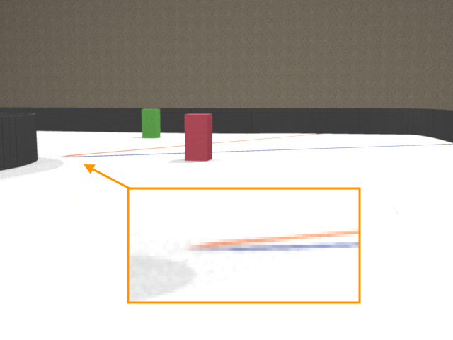

Although the images were made from the same camera position and with the same angle of view, it is clear that the thickness of the blue and orange lines is not enough to recognize them on the second image.

### Point of view

The direction in which the camera is fixed on the vehicle determines which objects will appear in the image frame. In order to simplify the image processing, we would like to get rid of the elements that are behind the game field walls, like judges or spectaculars.

Here, the camera is fixed at the height of 100 mm, and [the pitch](https://en.wikipedia.org/wiki/Aircraft_principal_axes){target=_blank} of the sensor plane is 10 degrees.

_Static image:_

_Video stream:_

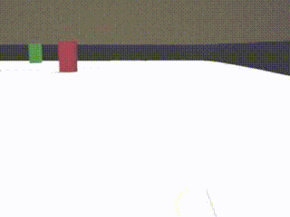

As you can see on the static image, the top edge of the exterior wall is located so that the camera almost does not perceive elements outside of the wall. The video stream is taken with another resolution. That's why the camera gets more information that does not belong to the game field. But pay attention to the average level of the wall's top edge - it does not change when the vehicle is moving, so [ROI (region of interest)](https://www.stemmer-imaging.com/en-se/knowledge-base/region-of-interest-roi/){target=_blank} will help limit the area for the image processing.

Additionally, the game objects that are in the the frame must not interfere with each other. On the picture above, the red and green cubes are almost on the same level. That's why, since the vehicle needs to turn left for the green cube and turn right for the red cube, it could be hard for the vehicle to make a decision which direction to choose. In order to get rid of this ambiguity, the camera can be fixed on a higher position and/or the pitch could be increased.

These samples are for the camera fixed at the height of 175 mm, and the pitch of the sensor plane is 14 degrees.

_Static image:_

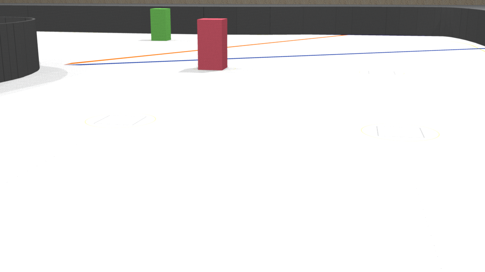

_Video stream:_

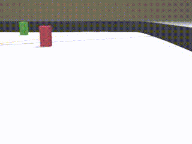

Another pair of samples is for the camera fixed at the height of 280 mm, and the pitch of the sensor plane is 17 degrees.

_Static image:_

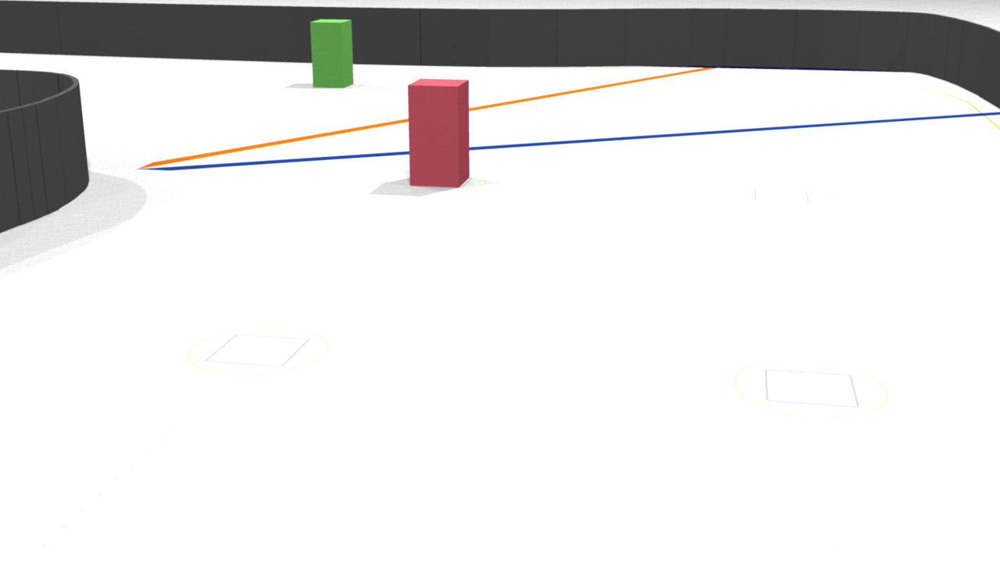

_Video stream:_

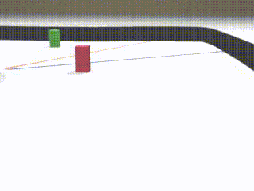

Please note, although the top edge of the exterior wall is located so that the frame does not contain any object outside the game field, the scene changes in the dynamic (on the video streams) representations so that it could be hard to specify a ROI that will reduce the number of unnecessary elements but will allow the vehicle to have early detection of the colored cube at the same time. (Earlier detection of the element simplifies the motion planning for the robot.)

### Lens

It is possible that the lens the camera is equipped with by default is not suitable for the particular task. 

This is a list of possible issues with the default lens:
  - [depth of field](https://en.wikipedia.org/wiki/Depth_of_field){target=_blank} is too small, so the objects distant from the camera's image plane are too blurred.
  - the light intensity delivered by the lens to the camera's sensor is not enough, so the resulting image is too dark or too noisy
  - the physical mount of the lens is not rigid enough, so the camera is unfocused when the vehicle is moving

Another possible case that needs to be considered twhen choosing another lens is that by using a [wide-angle lens](https://en.wikipedia.org/wiki/Wide-angle_lens){target=_blank}, the amount of useful information delivered to the camera's sensor can be increased without changing the point of view.

Look at the following video streams:

_The angle of view is 45 degrees:_

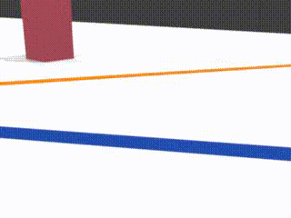

_The angle of view is 120 degrees:_

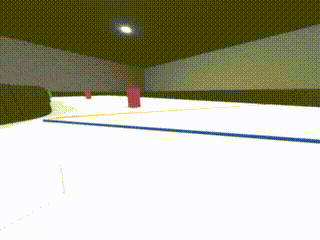

In both cases, the vehicle drove almost the same path. The camera was fixed on the height 100mm and the pitch was 17 mm, but you can see that in the second case the camera perceives more information, so the algorithm can discover the walls, perform early detection of the colored cube, and track the cube until it is fully passed.

## Objects recognition

A convenient way for beginners to start getting familiar with the computer vision approaches is to work with [the OpenCV library](https://en.wikipedia.org/wiki/OpenCV){target=_blank}. This library has holdings for almost all popular programming languages.

Those who use Python and aren't familiar with the OpenCV can learn essentials of the library through [the official tutorials](https://docs.opencv.org/master/d6/d00/tutorial_py_root.html){target=_blank}.  

Below is a general pipeline that can be implemented as a base of the algorithm for participation in the Future Engineers competition.

### Region of interest

Consider the following image of two objects: red and green cubes:

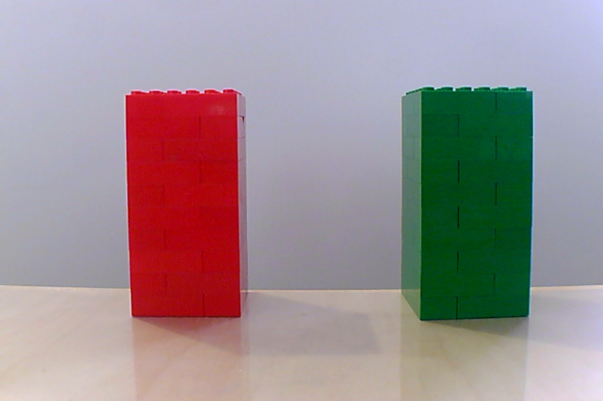

Imagine the situation when we know in advance a distance from which the object should be recognized. If the object is located on the same plane the vehicle is moving upon, it means that the bottom edge of the object's shape on the image could be expected approximately on the same row of pixels.

Based on this fact, we can choose a region of the image and work further only with it. Since the region is less than entire image, the next image processing and object detection will be performed faster.

_Cropped image:_

Basic OpenCV operations with images are covered in [this tutorial](https://docs.opencv.org/master/d3/df2/tutorial_py_basic_ops.html){target=_blank}.

### Image de-nosing

Even if, on the image above, one object looks red and another one looks green, a small zoom will demonstrate that the colors are not uniform (especially on the green object).

_Red cube:_

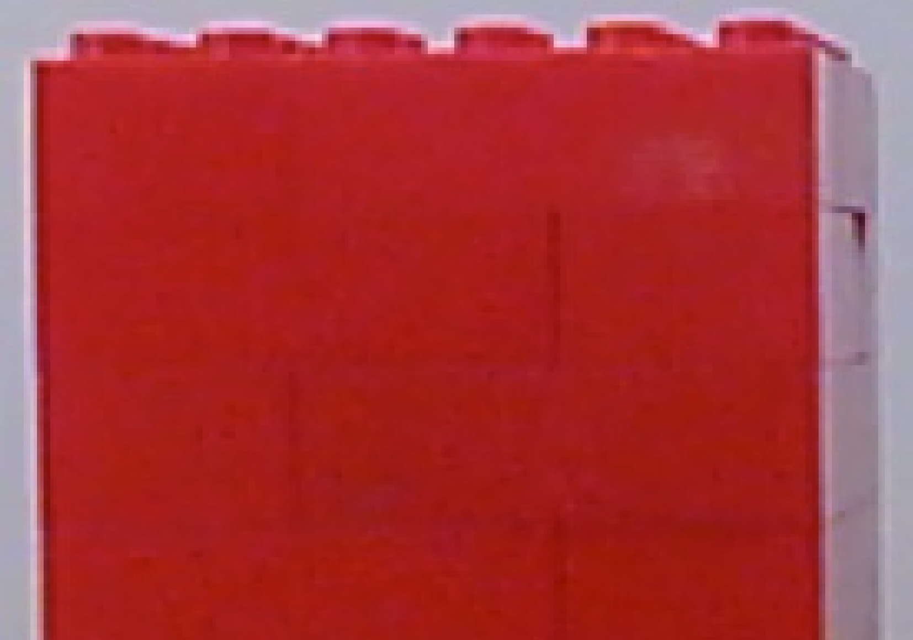

_Green cube:_

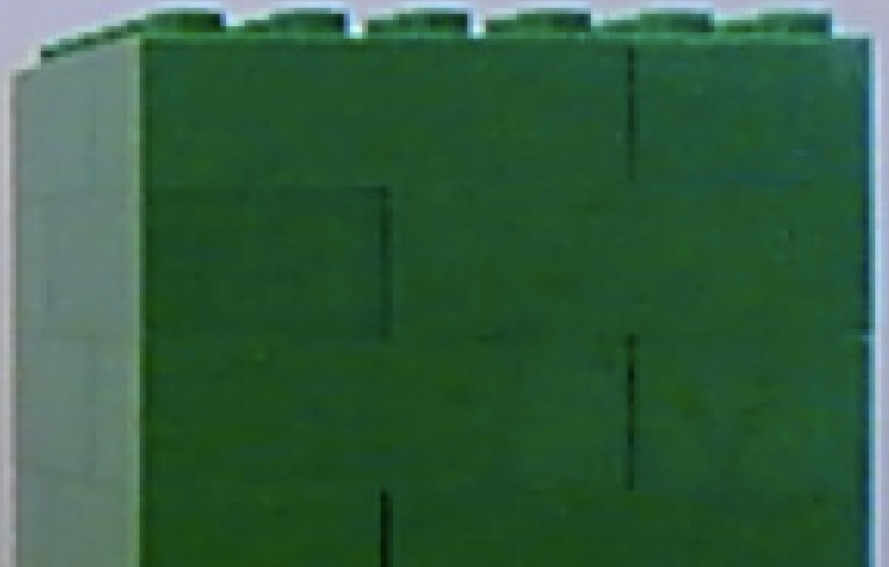

Bearing in mind that the colors on the digital images are represented by a set of numbers, if we specify some specific color, we cannot expect that a) this color necessarily exists on the image at all; or that b) we can find enough pixels of this color to say for sure that there is an object of this color on the image.

That's why, usually, the images are smoothed to reduce gradations of the same color. The same process is used in digital photography to reduce the amount of digital noise on the image.

_Smoothed image:_

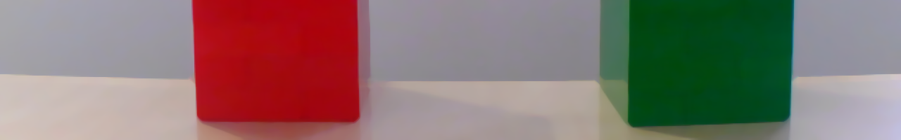

How to implement smoothing with OpenCV can be read [here](https://docs.opencv.org/master/d4/d13/tutorial_py_filtering.html){target=_blank}.

### Thresholding

Thresholding is a way to find pixels on an image that correspond with some property. Depending on the color scheme used to encode the image, the property of the pixel can be its color. 

For example, the widely used RGB color scheme allows us to say how much red, green, or blue component is contained in a pixel. The completely white pixel contains a maximum of red, green, and blue colors. The completely black pixel contains no red, green, or blue colors at all.

So, one could assume that if we need to discover a red object on the image, we need to look at the red component of each pixel and if it is at maximum, the pixel belongs to a red object. But it is not true.

Let's look at the red components of the pixels in the image:

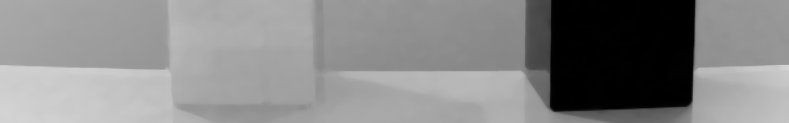

Here, the brightest pixels correspond to the maximum of the red component. As you can see, lots of pixels have a maximum in the red component. Why? Recall that the red component of a white pixel is the highest possible.

In fact, it is more logical to look at the pixels where the red component is at maximum and the blue and green components are on the lowest values. 

_Green component:_

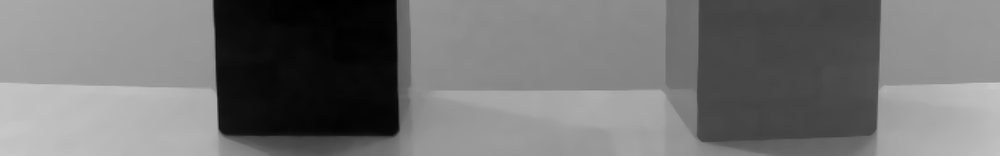

_Blue component:_

But this leads to nontrivial logic to implement a threshold which will become even more complicated if the light conditions are being changed.

That is why it makes sense to use another color scheme which is more suitable for color recognition. This scheme is called [HSV (Hue+Saturation+Value)](https://en.wikipedia.org/wiki/HSL_and_HSV){target=_blank}. The color of the pixel is encoded by the Hue component. The changing light conditions will not affect the Hue component but are reflected in the Saturation and Value components.

Here is how the image looks if HSV components are separated (the brightest pixels correspond to the highest value of the component):

_Hue component:_

_Saturation component:_

_Value component:_

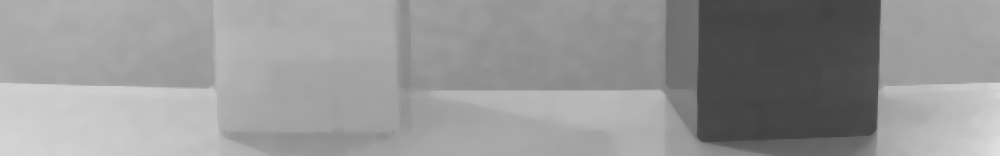

So if we know the range that corresponds to some color in the Hue component, we can filter out all pixels within this range.

The OpenCV library allows us to generate a binary representation of the image where the black pixels correspond to the original image's pixels that are outside of the range. This representation is also called the "mask".

_The mask for the red object:_

_The mask for the green object:_

The example of filtering out the pixels in the HSV color scheme can be found in [this article](https://docs.opencv.org/master/df/d9d/tutorial_py_colorspaces.html){target=_blank}.

In some cases it can be found that even if smoothing was applied to the image before thresholding, the result (the mask) is still not solid like the mask for the red object on the image above. In this case, one could consider using one of the morphological transformations to enhance the mask.

For example, if the transformation "dilation followed by erosion" (also known as Closing) is applied to the red object's mask, the amount of "holes" inside the mask can be reduced:

Note that additional transformation will slow down the overall process of the object's recognition, so use it only in a case when smoothing plus thresholding do not return good results.

More details about the morphological transformations can be found in [the corresponding part of the OpenCV documentation](https://docs.opencv.org/master/d9/d61/tutorial_py_morphological_ops.html){target=_blank}.

### Center of an object (centroid)

The useful result of having the mask for an object on the image is that the contour of the object becomes unambiguously detectable. 

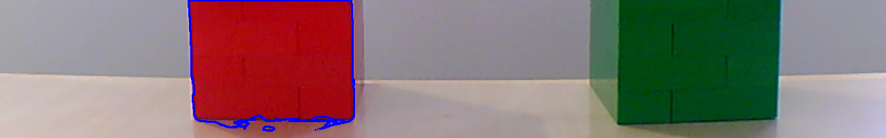

Even if, for some reason, there is more than one contour on the mask, they can be sorted by their areas so the contour with the maximum area will later be considered the target for the algorithm.

And as soon as the contour is known, the pixels within the contour could be used for different purposes. The use of an object's pixel information to identify the properties of the objects is called [the image moment](https://en.wikipedia.org/wiki/Image_moment){target=_blank}.

For example, if you accumulate `X` coordinates of all pixels belonging to an object and divide the result by the total number of pixels (area) in this object, you will get an average `X` coordinate. If you do the same for the `Y` coordinates, eventually you will get the center of the object (centroid).

_The Y coordinate of the red object centroid:_

_The Y coordinate of the green object centroid:_

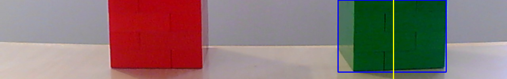

The `Y` coordinate of the centroid is useful to track the position of the object with respect to the vehicle in the Future Engineers competition. If the object is green and its `Y` coordinate is in the left side of the frame, the vehicle must perform a maneuver to the left so that the centroid of the green object is measured closer to the right side of the next frame.

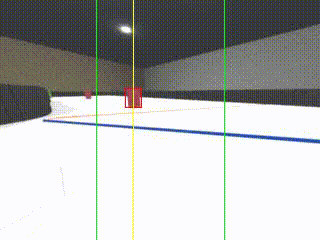

The following tutorials will help you understand how contours could be detected with the OpenCV library and how the center of the objects can be received from the contours:

  * [OpenCV center of contour](https://www.pyimagesearch.com/2016/02/01/opencv-center-of-contour/){target=_blank}
  * [Ball Tracking with OpenCV](https://www.pyimagesearch.com/2015/09/14/ball-tracking-with-opencv/){target=_blank}

There is [a big section in the OpenCV documentation dedicated to the image contours](https://docs.opencv.org/master/d3/d05/tutorial_py_table_of_contents_contours.html){target=_blank} and operations with them:

## Lane detection 

Some of the techniques described above can be used to detect the black walls surrounding the track. It means that the vehicle can use the camera not only to detect the green and red objects but also to detect the lane and adjust the steering mechanism correspondingly to drive in the middle of the lane.

Here are two articles that cover in detail how to implement either [the lane following](https://towardsdatascience.com/deeppicar-part-4-lane-following-via-opencv-737dd9e47c96){target=_blank} (when the lane is marked by the tape) or [the line following](https://becominghuman.ai/autonomous-racing-robot-with-an-arduino-a-raspberry-pi-and-a-pi-camera-3e72819e1e63){target=_blank}. These articles are also useful since they demonstrate how to solve the task on hardware that is similar to the equipment allowed to be used in the Future Engineers competition.

## Performance improvements 

The operation to read a frame from a camera could be quite costly from a performance perspective, as per the nature of the I/O (input/output) layer implementation. Imagine, when the frame is being received by the OpenCV library from the camera the rest of your code just waits. That is why it seems reasonable to divide the program at least into two parts working in parallel: one will read new frames, another will process appearing frames. Such parts of the program are called threads. And this tutorial explains [how the performance of the image processing program can be improved with usage of threads](https://www.pyimagesearch.com/2015/12/21/increasing-webcam-fps-with-python-and-opencv/){target=_blank}.

### Smart cameras

Another approach to allow your code to perform only "useful" action is to delegate the frame collection and, probably, some initial processing to a separate controller. That is why the idea to use smart cameras - cameras that could be considered as a combination of a controller plus a camera - looks like a good idea.

Here is links to [the wiki pages](https://docs.pixycam.com/wiki/doku.php?id=wiki:v2:start){target=_blank} of [PixyCam v2](https://dronebotworkshop.com/pixy2-camera/){target=_blank} and [the documentation for OpenMVCam](https://docs.openmv.io/openmvcam/quickref.html){target=_blank}.

